# Projet DevOps — Infrastructure & Déploiement

Projet réalisé par Oscar DEBEURET et Geoffrey IBOS dans le cadre du module DevOps.

Objectif : déployer une infrastructure cloud complète et automatisée avec Terraform, Ansible et Molecule.

Le projet respecte les contraintes suivantes :

* Infrastructure provisionnée entièrement avec Terraform
* Déploiement automatisé avec Ansible
* Tests des rôles Ansible avec Molecule
* Architecture multi-machines avec Load Balancer
* Base PostgreSQL dédiée
* Sauvegardes automatiques vers S3
* Documentation complète et reproductible

---

# 1. Architecture du projet

Architecture déployée :

```text
Internet
   │
   ▼
[ AWS Application Load Balancer ]
   │
   ├───────────────┬───────────────┐
   ▼                               ▼
[ VM App 1 ]                 [ VM App 2 ]
(Nginx + Node.js)            (Nginx + Node.js)
   │                               │
   └───────────────┬───────────────┘
                   ▼
          [ AWS RDS PostgreSQL ]
                   │
                   ▼
             [ AWS S3 Bucket ]
             (Backups SQL)
```

---

# 2. Technologies utilisées

## Infrastructure

* AWS
* Terraform
* VPC
* EC2
* Security Groups
* Application Load Balancer
* RDS PostgreSQL
* S3

## Configuration & déploiement

* Ansible
* Ansible Vault
* Molecule
* Docker

## Application

### Backend

* Node.js
* Express
* PostgreSQL (`pg`)

### Frontend

* HTML
* JavaScript
* Nginx

---

# 3. Structure du repository

```text
devops-project/
├── ansible/
│   ├── inventories/
│   ├── roles/
│   │   ├── application/
│   │   ├── backup/
│   │   └── database/
│   └── site.yml
│
├── terraform/
│
├── app/
│   ├── backend/
│   └── frontend/
│
├── scripts/
│   └── check-ansible.sh
│
├── .ansible-lint
├── .yamllint.yml
├── .gitignore
└── README.md
```

---

# 4. Flux réseau

## Flux HTTP utilisateur

```text
Client Web
    │
    ▼
ALB :80
    │
    ▼
Nginx VM App
    │
    ▼
Backend Node.js :3000
    │
    ▼
PostgreSQL RDS :5432
```

## Flux backup

```text
VM App
   │
   ▼
pg_dump PostgreSQL
   │
   ▼
Upload AWS CLI
   │
   ▼
Bucket S3
```

---

# 5. Ports utilisés

| Service         | Port | Description                |
| --------------- | ---- | -------------------------- |
| HTTP            | 80   | Accès utilisateur via ALB  |
| Node.js backend | 3000 | API backend                |
| PostgreSQL      | 5432 | Base de données            |
| SSH             | 22   | Administration             |
| HTTPS           | 443  | Prévu pour extension HTTPS |

---

# 6. Sécurité réseau

## Security Groups

### Load Balancer

Ports ouverts :

* 80/tcp depuis Internet

### VMs applicatives

Ports ouverts :

* 22/tcp depuis IP admin
* 80/tcp depuis ALB

### Base PostgreSQL (RDS)

Ports ouverts :

* 5432/tcp uniquement depuis les VMs applicatives

La base de données n’est pas exposée publiquement.

---

# 7. Prérequis

## Logiciels requis

* Git
* Terraform >= 1.6
* Ansible >= 2.17
* Python 3
* pip
* Docker
* AWS CLI

## Vérification

```bash
terraform version
ansible --version
docker --version
```

## Environnement Python virtuel

Le projet utilise un environnement virtuel Python afin d’isoler les dépendances Ansible et Molecule du système local.

Création de l’environnement :

```bash
python3 -m venv .venv
```

Activation :

```bash
source .venv/bin/activate
```

Installation des dépendances :

```bash
pip install --upgrade pip

pip install \
ansible \
ansible-lint \
yamllint \
molecule \
molecule-docker \
docker \
passlib
```

Vérification :

```bash
molecule --version
ansible --version
```

---

# 8. Configuration AWS

## AWS CLI

Configurer AWS CLI :

```bash
aws configure
```

Renseigner :

* Access Key
* Secret Key
* Région : eu-west-3

---

# 9. Génération de la clé SSH

Créer une clé SSH :

```bash
ssh-keygen -t ed25519 -f ~/.ssh/devops_s8
```

Cela génère :

```text
~/.ssh/devops_s8
~/.ssh/devops_s8.pub
```

---

# 10. Variables Vault

Créer le fichier :

```text
ansible/inventories/dev/group_vars/all/vault.yml
```

Chiffrer le fichier :

```bash
ansible-vault encrypt ansible/inventories/dev/group_vars/all/vault.yml
```

Contenu attendu :

```yaml
vault_db_password: "CHANGE_ME"

vault_aws_access_key_id: "CHANGE_ME"

vault_aws_secret_access_key: "CHANGE_ME"
```


IMPORTANT :

* Ne jamais commit les secrets
* Le fichier `vault.yml` est ignoré par `.gitignore`

---

# 11. Déploiement Terraform

## Initialisation

```bash
cd terraform

terraform init
```

## Formatage

```bash
terraform fmt
```

## Validation

```bash
terraform validate
```

## Plan

```bash
terraform plan
```

## Déploiement

```bash
terraform apply
```

Valider avec :

```text
yes
```

Suppression complète des ressources AWS à la fin :

```bash
terraform destroy
```

---

# 12. Récupération des outputs Terraform

```bash
terraform output
```

Exemple :

```text
alb_dns_name
app_public_ips
backup_bucket_name
rds_endpoint
```

---

# 13. Configuration inventaire Ansible

Modifier :

```text
ansible/inventories/dev/hosts.yml
```

Ajouter les IP publiques des VMs applicatives.

Exemple :

```yaml
app:
  hosts:
    app1:
      ansible_host: X.X.X.X
    app2:
      ansible_host: X.X.X.X
```

---

# 14. Test de connectivité Ansible

```bash
ansible -i ansible/inventories/dev/hosts.yml app -m ping --ask-vault-pass
```

Résultat attendu :

```text
pong
```

---

# 15. Déploiement Ansible

Déployer toute l’infrastructure logicielle :

```bash
ansible-playbook \
-i ansible/inventories/dev/hosts.yml \
ansible/site.yml \
--ask-vault-pass
```

---

# 16. Vérification de l’application

Récupérer le DNS du Load Balancer :

```bash
terraform output alb_dns_name
```

Tester :

```bash
curl http://ALB_DNS_NAME
```

Tester l’API :

```bash
curl http://ALB_DNS_NAME/api/votes

curl -X POST http://ALB_DNS_NAME/api/vote
```

---

# 17. Vérification base PostgreSQL

Depuis une VM applicative :

```bash
PGPASSWORD='PASSWORD' \
psql \
-h RDS_ENDPOINT \
-U appuser \
-d appdb \
-c "SELECT COUNT(*) FROM votes;"
```

Le compteur augmente après chaque vote.

---

# 18. Vérification des services

## Backend

```bash
sudo systemctl status vote-app
```

## Logs backend

```bash
sudo journalctl -u vote-app -f
```

## Nginx

```bash
sudo systemctl status nginx
```

---

# 19. Tests Molecule

Chaque rôle possède un scénario Molecule :

* application
* backup
* database

## Exécution d’un test

Exemple :

```bash
cd ansible/roles/application

molecule test
```

Résultat attendu :

```text
Verifier completed successfully.
```

---

# 20. Vérification Ansible globale

Script de vérification :

```bash
./scripts/check-ansible.sh
```

Ce script exécute :

* ansible-lint
* yamllint
* molecule

---

# 21. Stratégie de backup

## Fonctionnement

Le rôle `backup` :

* crée un dump PostgreSQL
* stocke le dump localement
* envoie le backup vers S3 avec AWS CLI
* planifie le backup via cron

## Fréquence

* quotidienne

## Localisation

Bucket S3 provisionné via Terraform : 

```text
devops-s8-backups-XXXXXXXX
```

---

# 22. Captures de validation

## Infrastructure Terraform

`terraform apply` :

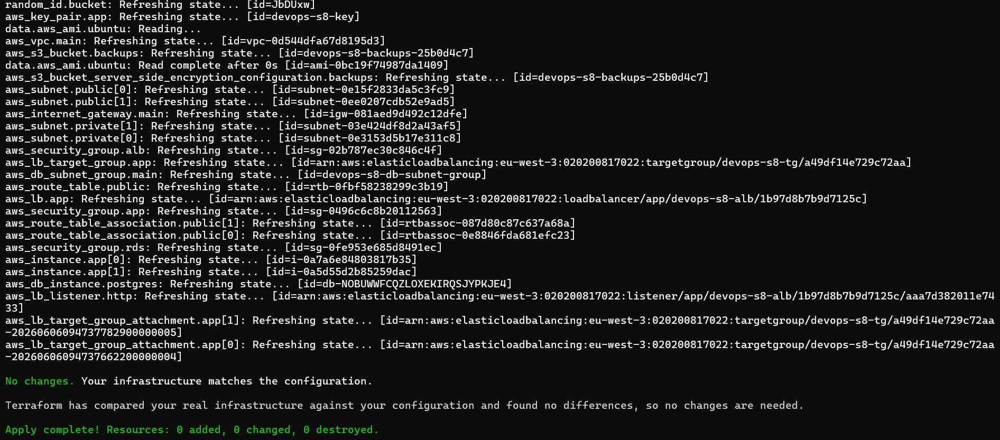


`terraform output` : 

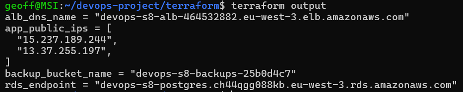

---

## Validation Ansible


```bash
ansible-playbook -i ansible/inventories/dev/hosts.yml ansible/site.yml --ask-vault-pass
```

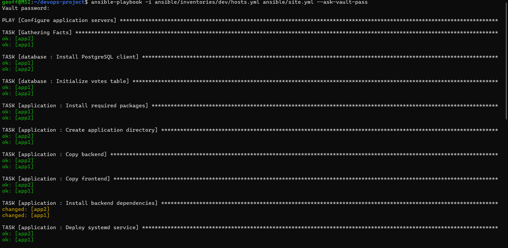
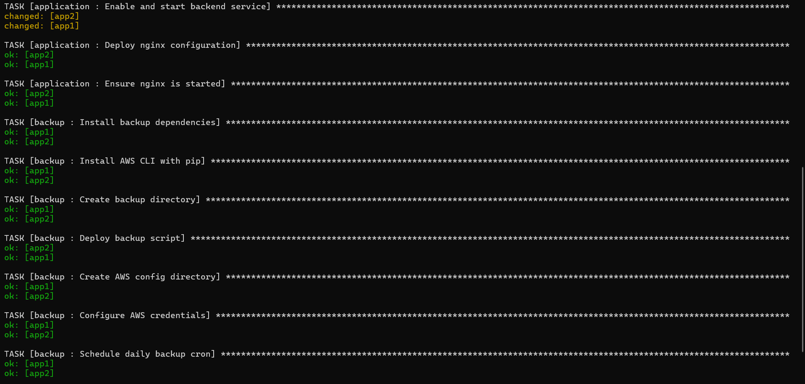
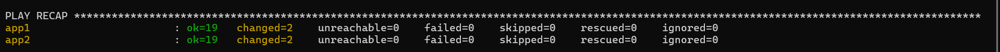

---

## Validation ansible-lint / yamllint

```bash
./scripts/check-ansible.sh
```

Validation globale qualité : 

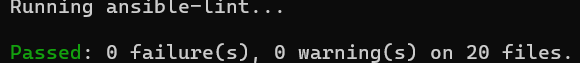

Molecule application — succès final : 

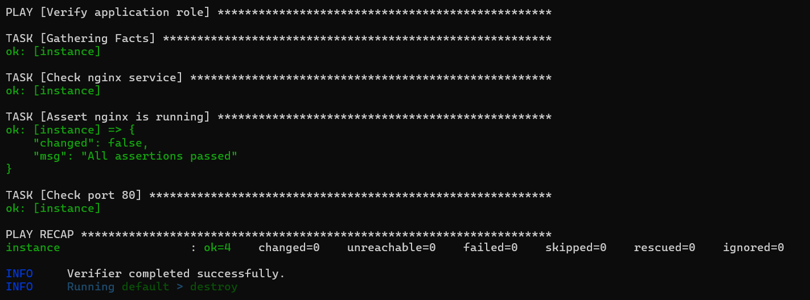

Molecule backup — succès final : 

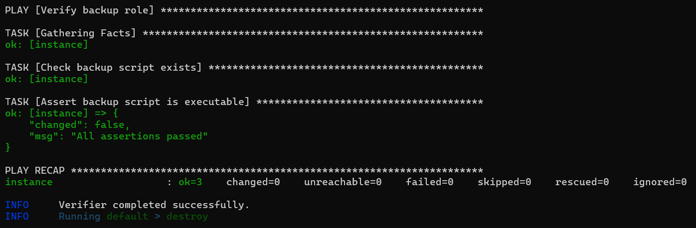

Molecule database — succès final :

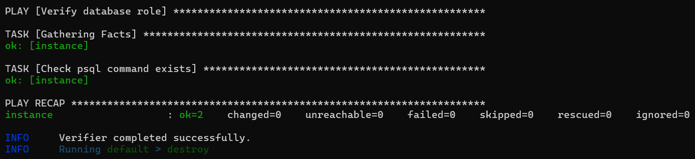

---

## Validation application web


---

## Validation API backend

Connexion à la VM en ssh :

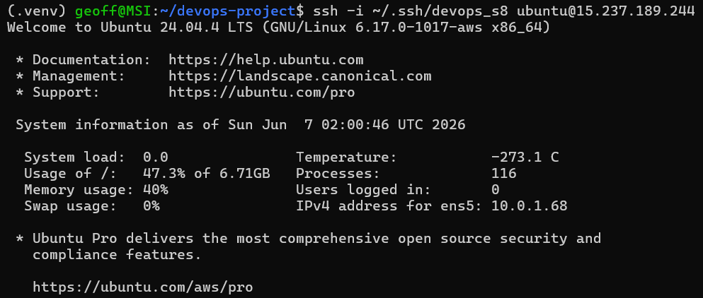

Tests API backend : 

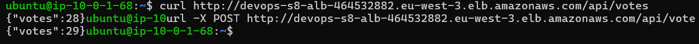

---

## Validation persistance PostgreSQL

```bash
SELECT COUNT(*) FROM votes;
```

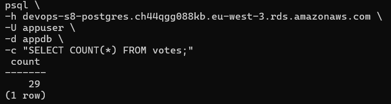

---

## Validation services Linux

```bash
sudo systemctl status vote-app
```

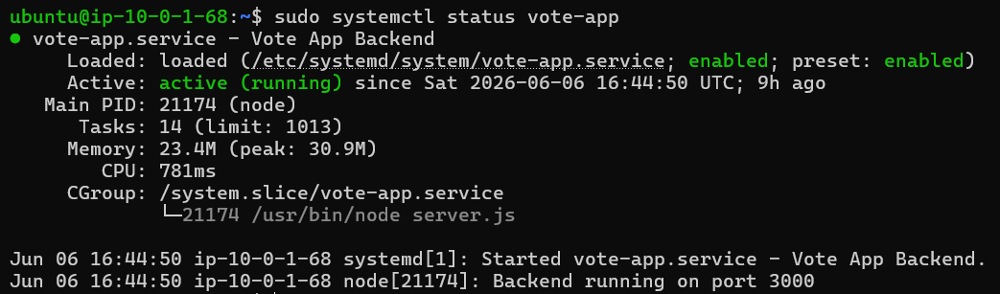

```bash
sudo systemctl status nginx
```

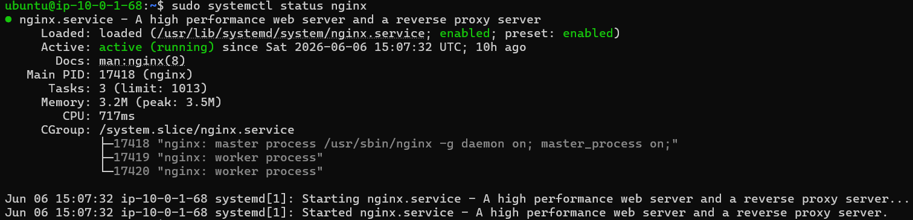

---

## Validation AWS

### Instances EC2 :

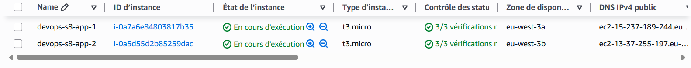

### Load Balancer :

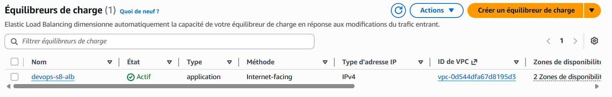

### Bucket S3 :

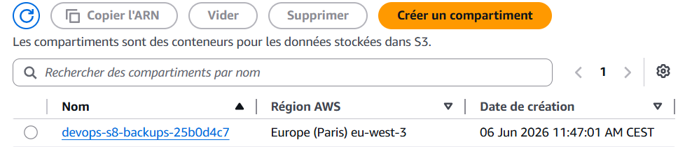

### Base de données RDS :

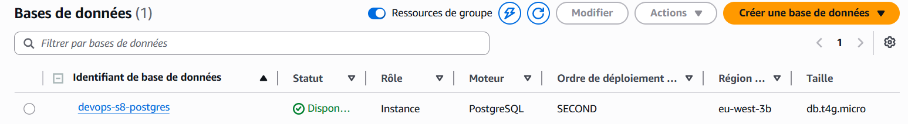
